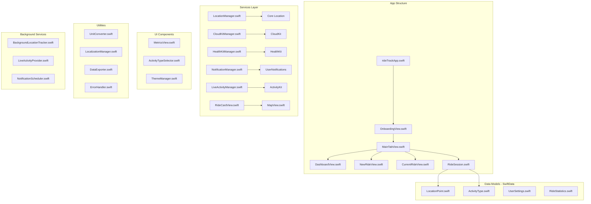
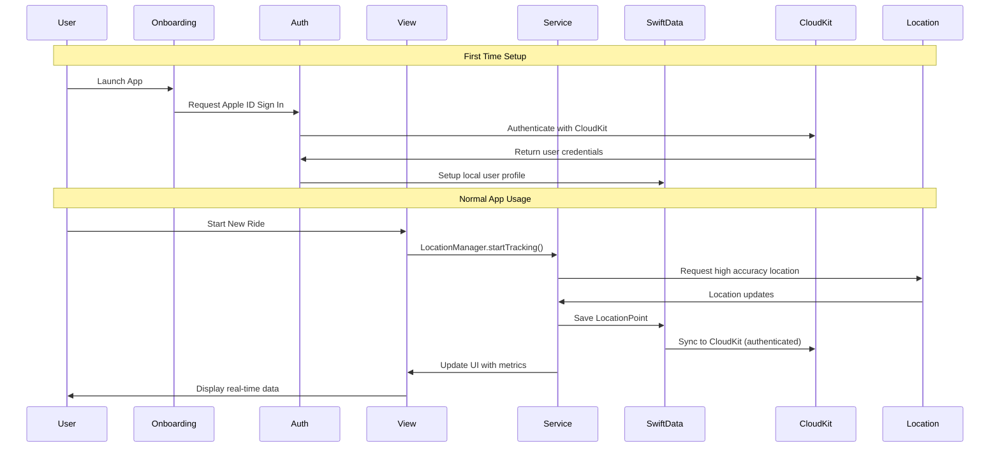
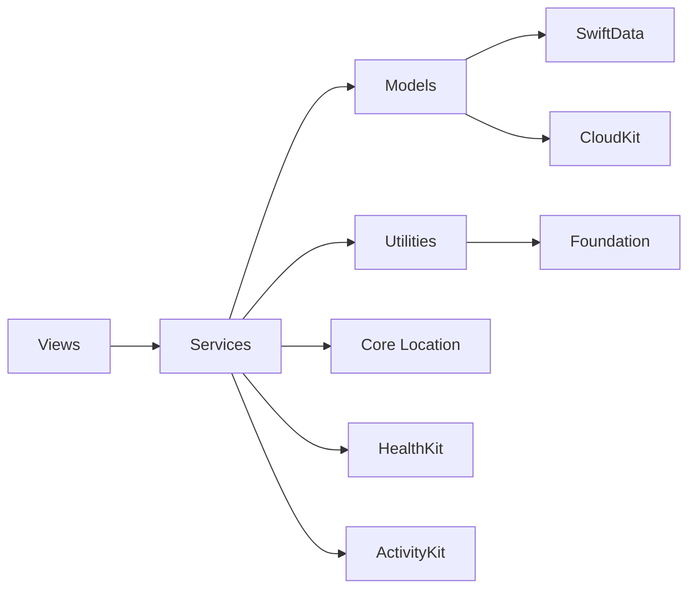

# RideTrack iOS App - Complete Architecture Diagram

## 📱 Project Structure Diagram



## 🗂️ Detailed File Structure

```
rideTrack/
├── App/
│   ├── rideTrackApp.swift                 # Main app entry point
│   ├── MainTabView.swift                  # Root navigation
│   └── AppDelegate.swift                  # App lifecycle management
│
├── Views/
│   ├── Onboarding/
│   │   ├── OnboardingView.swift          # Initial app setup
│   │   ├── WelcomeView.swift             # Welcome screen
│   │   ├── PermissionsView.swift         # Permission requests
│   │   └── AccountSetupView.swift        # Apple ID setup
│   │
│   ├── Dashboard/
│   │   ├── DashboardView.swift           # Main dashboard screen
│   │   ├── RideCardView.swift            # Individual ride card component
│   │   └── RideDetailView.swift          # Detailed ride view
│   │
│   ├── NewRide/
│   │   ├── NewRideView.swift             # New ride configuration
│   │   ├── ActivityTypeSelector.swift    # Activity type picker
│   │   └── RidePreparationView.swift     # Pre-ride setup
│   │
│   ├── CurrentRide/
│   │   ├── CurrentRideView.swift         # Active tracking screen
│   │   ├── MapView.swift                 # Map display component
│   │   ├── MetricsView.swift             # Real-time metrics
│   │   └── RideControlsView.swift        # Pause/Stop controls
│   │
│   ├── Settings/
│   │   ├── SettingsView.swift            # Main settings screen
│   │   ├── UserProfileView.swift         # User account management
│   │   ├── UnitsSettingsView.swift       # Units configuration
│   │   ├── LanguageSettingsView.swift    # Language selection
│   │   ├── ThemeSettingsView.swift       # Theme customization
│   │   └── DataSettingsView.swift        # Sync and export settings
│   │
│   └── Common/
│       ├── LoadingView.swift             # Loading states
│       ├── ErrorView.swift               # Error handling UI
│       └── EmptyStateView.swift          # Empty state displays
│
├── Models/
│   ├── RideSession.swift                 # Main ride data model
│   ├── LocationPoint.swift               # GPS coordinate model
│   ├── ActivityType.swift                # Activity type enum/model
│   ├── UserProfile.swift                 # User account data model
│   ├── UserSettings.swift                # User preferences model
│   ├── RideStatistics.swift              # Calculated metrics model
│   └── CloudKitModels.swift              # CloudKit-specific models
│
├── Services/
│   ├── Location/
│   │   ├── LocationManager.swift         # Core Location wrapper
│   │   ├── GPSTracker.swift              # GPS tracking logic
│   │   └── RouteCalculator.swift         # Route analysis
│   │
│   ├── Data/
│   │   ├── CloudKitManager.swift         # CloudKit synchronization
│   │   ├── DataManager.swift             # SwiftData operations
│   │   └── CacheManager.swift            # Local caching
│   │
│   ├── Health/
│   │   ├── HealthKitManager.swift        # HealthKit integration
│   │   └── WorkoutManager.swift          # Workout session handling
│   │
│   ├── Authentication/
│   │   ├── AuthenticationManager.swift   # Apple ID authentication
│   │   ├── UserAccountManager.swift      # User account operations
│   │   └── OnboardingManager.swift       # First-time setup
│   │
│   ├── Notifications/
│   │   ├── NotificationManager.swift     # Local notifications
│   │   ├── LiveActivityManager.swift     # Live Activities
│   │   └── PushNotificationHandler.swift # Remote notifications
│   │
│   └── Background/
│       ├── BackgroundLocationTracker.swift # Background GPS
│       ├── BackgroundTaskManager.swift   # Background processing
│       └── AppStateManager.swift         # App state handling
│
├── Utilities/
│   ├── Extensions/
│   │   ├── CLLocation+Extensions.swift   # Location utilities
│   │   ├── Date+Extensions.swift         # Date formatting
│   │   └── Double+Extensions.swift       # Number formatting
│   │
│   ├── Helpers/
│   │   ├── UnitConverter.swift           # Metric/Imperial conversion
│   │   ├── LocalizationManager.swift     # Multi-language support
│   │   ├── ThemeManager.swift            # Theme management
│   │   └── PermissionManager.swift       # Permission handling
│   │
│   └── Constants/
│       ├── AppConstants.swift            # App-wide constants
│       ├── ColorConstants.swift          # Color definitions
│       └── StringConstants.swift         # String constants
│
├── Resources/
│   ├── Localizable.strings               # English strings
│   ├── Localizable-ru.strings            # Russian strings
│   ├── Localizable-id.strings            # Indonesian strings
│   ├── Localizable-el.strings            # Greek strings
│   └── Assets.xcassets/                  # Images and colors
│
├── Configuration/
│   ├── Info.plist                        # App configuration
│   ├── rideTrack.entitlements           # App capabilities
│   └── Config.swift                      # Environment config
│
└── Supporting Files/
    ├── DataExporter.swift                # Import/Export functionality
    ├── ErrorHandler.swift                # Global error handling
    └── Logger.swift                      # Logging system
```

## 🔄 Data Flow Architecture



## 🏗️ Component Dependencies



## 📋 Implementation Phases

### Phase 1: Core Foundation & Authentication
- [ ] Apple ID authentication setup
- [ ] Onboarding flow implementation
- [ ] SwiftData models setup
- [ ] Basic navigation structure
- [ ] User profile management

### Phase 2: Location & Tracking Features
- [ ] Location services integration
- [ ] Dashboard with basic ride display
- [ ] New ride configuration
- [ ] Real-time tracking screen
- [ ] Background location tracking

### Phase 3: Advanced Features & Sync
- [ ] CloudKit synchronization with user accounts
- [ ] Live Activities implementation
- [ ] Settings and customization
- [ ] HealthKit integration
- [ ] Data persistence

### Phase 4: Polish & Optimization
- [ ] Localization
- [ ] Theme system
- [ ] Data import/export
- [ ] Performance optimization

## 🔧 Key Technical Decisions

### Location Tracking Strategy
- **High Accuracy GPS**: For precise route recording
- **Background Modes**: Continuous tracking when app backgrounded
- **Smart Sampling**: Adaptive sampling based on speed and activity type

### Authentication & User Management
- **Apple ID Integration**: Seamless sign-in with Apple ID for CloudKit access
- **User Profiles**: Personal data stored securely in CloudKit private database
- **Onboarding Flow**: First-time setup with permission requests and account creation

### Data Architecture
- **SwiftData**: Primary local storage with automatic CloudKit sync
- **User-Scoped Data**: All ride data tied to authenticated user account
- **Local-First**: All operations work offline, sync when available
- **Conflict Resolution**: Last-write-wins with user notification for conflicts

### UI Architecture
- **MVVM Pattern**: Clear separation of concerns
- **Reactive UI**: SwiftUI with @Observable and @Query
- **Modular Components**: Reusable UI components across screens

### Background Processing
- **Live Activities**: Real-time lock screen updates
- **Background App Refresh**: Data sync and processing
- **Location Background Mode**: Continuous GPS tracking

This architecture provides a comprehensive blueprint for implementing the RideTrack sports tracker app with all requested features and future Apple Watch integration capability.